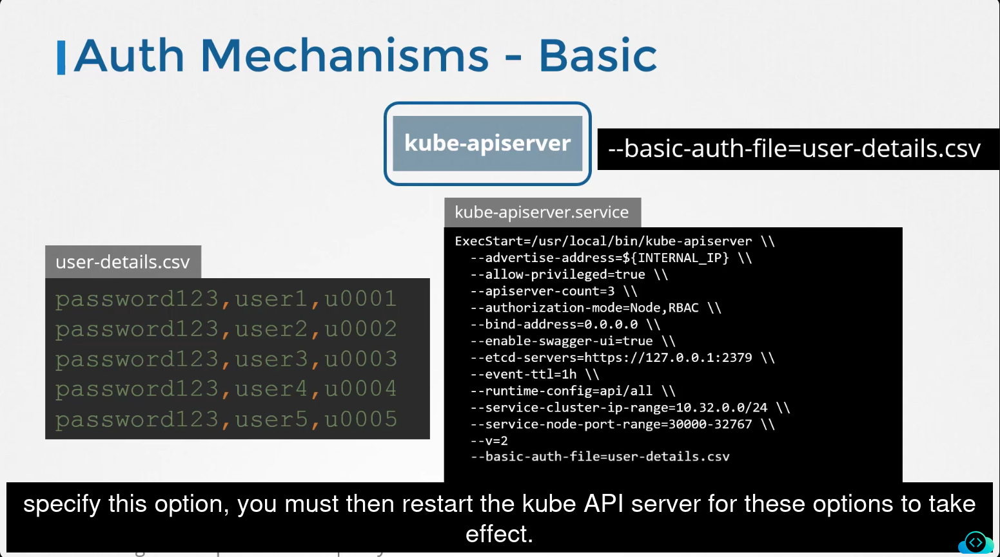
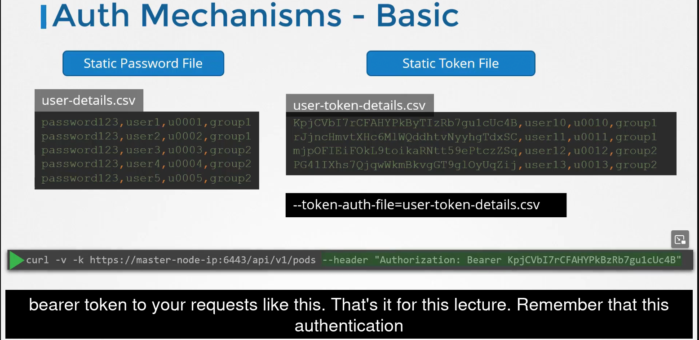
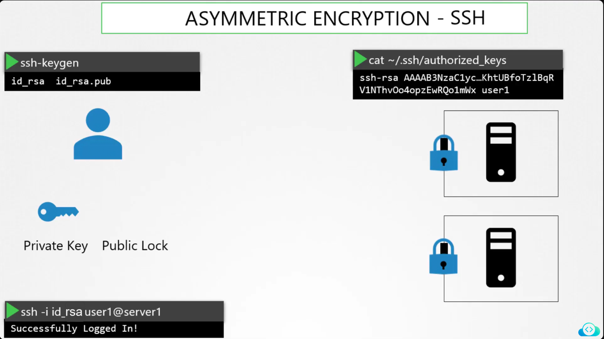

2375 port -> docker is running

4C's
1.Cloud -> misconfigurations
2.Cluster -> 
3.Container -> 
4.Code ->

1.CIS(Center for Internet Security) Benchmarks:
The CIS-CAT Lite tool helps organizations check if their systems meet security benchmarks recommended by CIS. It can assess the configurations of operating systems, software, and network devices against these security standards.
The key features of CIS-CAT Lite include:
    1.Security Configuration Assessment: It assesses system configurations based on CIS benchmarks.
    2.Automated Reporting: It generates a report detailing the system's compliance status.
    3.Free Version: CIS-CAT Lite is available for free, but it provides fewer features compared to the full version, CIS-CAT Pro.

##We have installed the CIS-CAT Pro Assessor tool called Assessor-CLI, under /root.
Please run the assessment with the Assessor-CLI.sh script inside Assessor directory and generate a report called index.html in the output directory /var/www/html/.Once done, the report can be viewed using the Assessment Report tab located above the terminal.
Run the test in interactive mode and use below settings:
Benchmarks/Data-Stream Collections: : CIS Ubuntu Linux 20.04 LTS Benchmark v2.0.1
Profile : Level 1 - Server
```bash
cd /root/Assessor
sh ./Assessor-CLI.sh -i -rd /var/www/html/ -nts -rp index

##Select the below after running it
#Benchmarks/Data-Stream Collections: CIS Ubuntu Linux 20.04 LTS Benchmark v2.0.1
#Profile: Level 1 - Server
```
CIS-CAT Lite doesn't support k8s
CIS-CAT pro support k8s

ii)Kube-bench -> OpenSource CIS benchmark tool for k8s
Install-> container,pod in k8s cluster, install kube-bench binary
```
curl -L https://github.com/aquasecurity/kube-bench/releases/download/v0.4.0/kube-bench_0.4.0_linux_amd64.tar.gz -o kube-bench_0.4.0_linux_amd64.tar.gz
tar -xvf kube-bench_0.4.0_linux_amd64.tar.gz
```

Run a kube-bench test now and see the results
Run below command to run kube bench
```
 ./kube-bench --config-dir `pwd`/cfg --config `pwd`/cfg/config.yaml
```

2.K8S security primitives
```
Secure Hosts: SSH key based auth. , Password based auth. disabled 
Restrict access to kube-apiserver 
authentication -> files(usernames & pwds), files(usernames & tokens), Certificates, LDAP, SA
authorization -> RBAC, attribute-ABAC, Node authorization, Webhook mode
TLS certificates between components
N/W policies
```
i)Authentication: Securing access to k8s cluster with accounts(used by humans),SA(Used by services). K8S doesn't manage user accounts natively,it relies on an external source like a file with user details, or crts or a thrid party identity services like LDAP.
##Auth mechanisms : static password file, static token file, crts, thris party services(LDAP & kerberos)

Authenticate user:
```
curl -v -k https://<master-node-ip>:6443/api/v1/pods -u "user1:password123"
curl -v -k https://<master-node-ip>:6443/api/v1/pods --header "Authorization: Bearer <user-token>"
```
Similarly in the csv file we will replace the password with token for Static Token File(auth Mechanism) and pass it with the argument --token-auth-file=user-token-details.csv 

```
Note: This is not recommended in a production environment. This is only for learning purposes. Also, note that this approach is deprecated in Kubernetes version 1.19 and is no longer available in later releases.
```
Two types of accounts: User accounts(Used by Humans), SA(Used by machines)
SA:
For pod.yaml
serviceAccountName: <sa-name>

Every NS has a default sa and secret object with token associated with it.
From v1.24 KEP-2799: Reduction of Secret-based SA tokens
: 
```
k create sa <sa-name>
k get sa
k create token <sa-name>
```
The generated token after decode we can see the expiry is 1 hour from the time we created the token.

3.TLS
Symmetric -> public key(lock) and key are sent here

```
openssl genrsa -out my-bank.key 1024
openssl rsa -in my-bank.key -pubout > mybank.pem
#CA - The below command creates csr(Certificate Signing Request) file
openssl req -new -key my-bank.key -out my-bank.csr -subj "/C=US/ST=CA/O=MyOrg, Inc./CN=my-bank.com"
```
Private key will be on the web server
How did the browsers know that CA is legitimate? What if it is certified by Fake CA?
The CAs themselves have a set of public and private key pairs. The CAs use their pvt keys to sign the crts. The public keys of all the CAs are built into the browsers. The browsers use the public key of the CA to validate crt was actually signed by CA themselves. 
